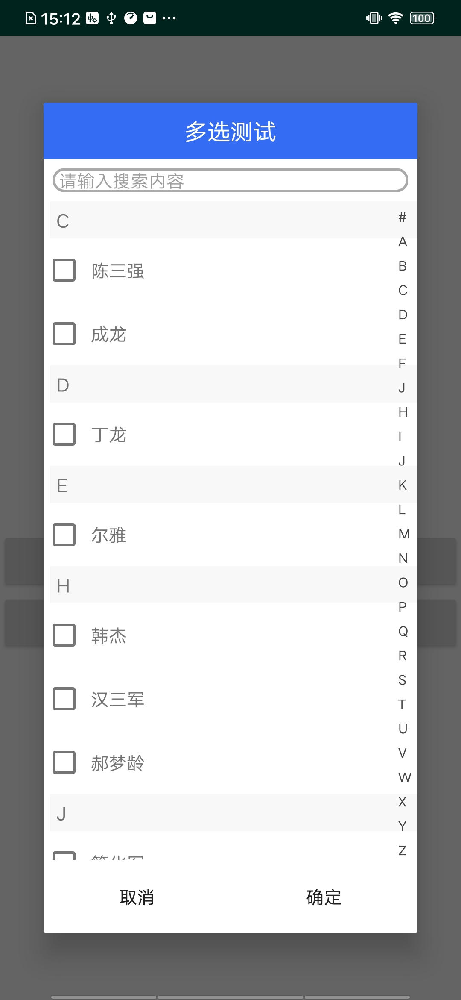
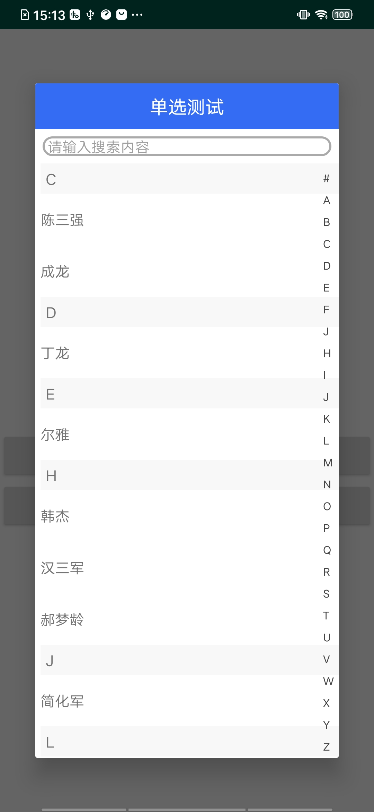

# MultiChioceSearchDialog
一个带搜索框和侧面筛选栏的单选、多选对话框
# 如何获得
* Android Studio  
请确保你的project级别的build.gradle已经添加了如下依赖  
```java
allprojects {
    repositories {
        maven { url 'https://jitpack.io' }
    }
}
```
如果上面的依赖已经存在，那就直接在你的moudle级别的build.gradle文件中添加如下依赖：  
```java
implementation 'com.github.hanjie511:MultiChioceSearchDialog:2.1.2'
``` 
* eclipse
点击链接下载该library的aar文件：  
[下载链接](https://github.com/hanjie511/MultiChioceSearchDialog/blob/master/MultiChioceDialog-release.aar)  
下面附上eclipse使用aar文件的方法：  
[传送门地址](https://blog.csdn.net/Developer_android/article/details/70054135?depth_1-utm_source=distribute.pc_relevant.none-task-blog-BlogCommendFromBaidu-1&utm_source=distribute.pc_relevant.none-task-blog-BlogCommendFromBaidu-1)  
# 如何使用
* step1  
```java
 multiChioceDialog=new MultiChioceDialog(Context context);//初始化对话框对象
 ArrayList<SortModel> list=new PinyinUtils().getSortedListByAlpha(ArrayList<SortModel> list);//获得要传入对话框的数据
 ```
 * step2  
 ```java
 multiChioceDialog.setTitleStr(String title);//设置对话框标题
 multiChioceDialog.setTitleBgColor("#000000");//自定义对话框标题栏背景颜色(可以不用设置)
 multiChioceDialog.setTitleTextColor("#FF32FF");//自定义对话框标题字体颜色(可以不用设置)
 ```
 * step3
 ```java
 multiChioceDialog.setDataList(ArrayList<SortModel> list);//设置对话框展示的数据源
 ```
 * step4
 ```java
 multiChioceDialog.setMultiChioce(boolean b);//设置多选或单选true为多选，false为单选
 multiChioceDialog.setCheckedItem(Boolean[] b);//设置记忆选项的Boolean数组，当为多选对话框时，必须设置该方法，单选时，可以忽略
 ```
 * step5
 ```java
 multiChioceDialog.setOnPositiveClickListener(new OnPositiveClickListener() {//获得选择结果
					
					@Override
					public void click(String name, String code, boolean[] check_item) {
						// TODO Auto-generated method stub
						object_text.setText(name);
						object_text.setTag(code);
						checkItem=check_item;
					}
				});
 ```
 * step6 
 ```java
 multiChioceDialog.show();
 ```
# 节目效果



